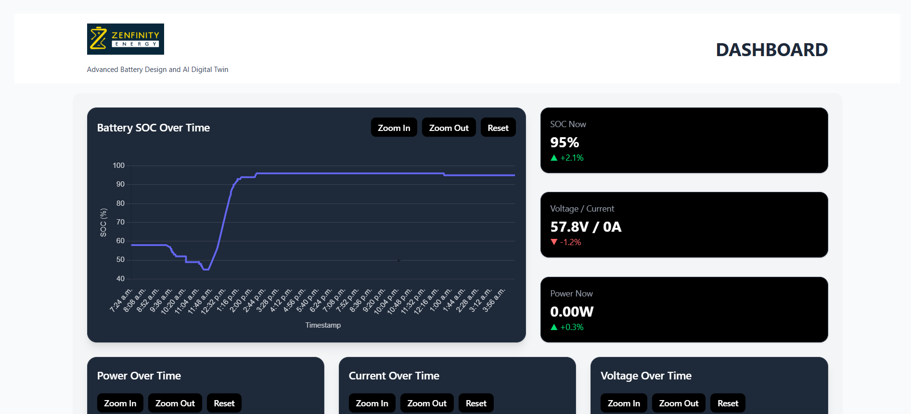
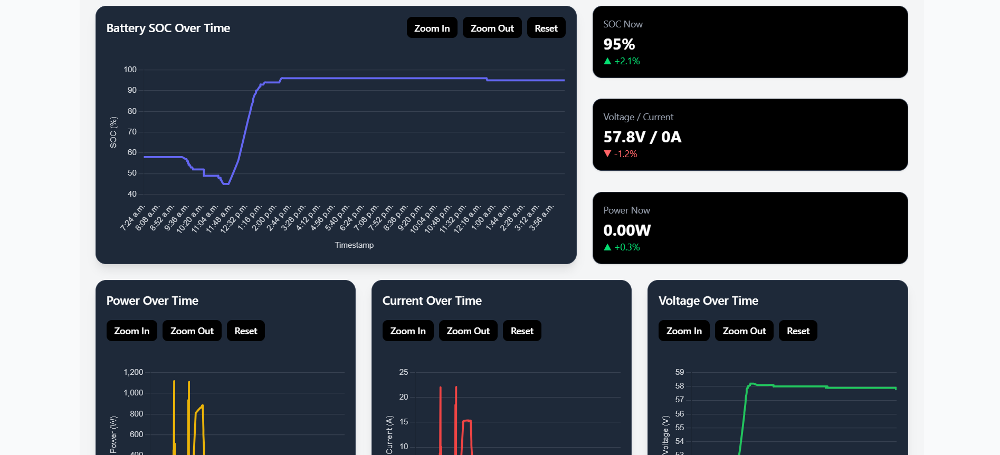
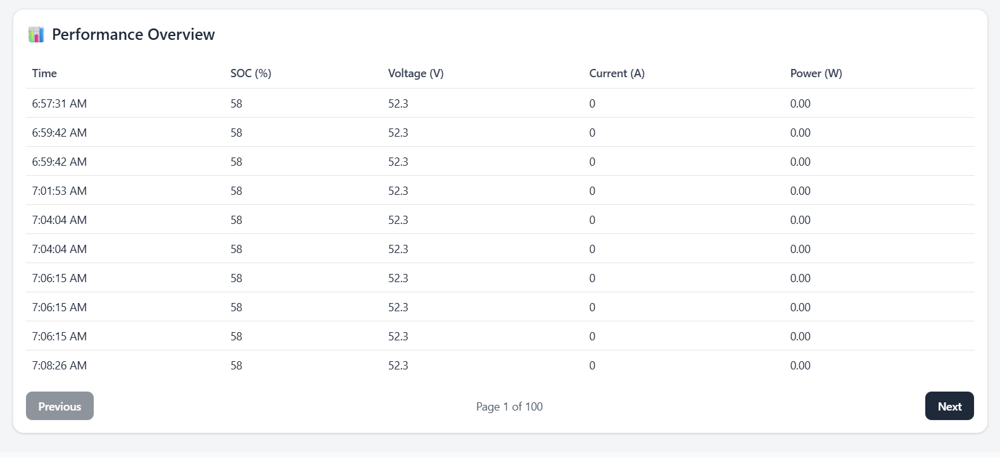

# ⚡ Zenfinity Battery Monitoring Dashboard



A sleek and real-time dashboard designed to monitor and analyze battery performance metrics including State of Charge (SOC), voltage, current, and power. Built as part of an internship task for **Zenfinity Energy**.

---

## 🔗 Live Demo
👉 [View Live Demo](https://zenfinity-battery-monitoring-dashbo.vercel.app/)

---

## ✨ Features

- 📈 **SOC (State of Charge) Tracking** over time
- 🔌 **Real-time Voltage & Current Monitoring**
- 🔋 **Live Power Calculation (V × I)**
- 📊 **Cumulative Ampere-hour (Ah)** chart for energy consumed
- 🔍 **Zoom/Pan support** in charts using Chart.js plugin
- 💻 **Fully Responsive** layout (mobile to desktop)
- 📄 **Paginated Data Table** showing all metrics in sync

---

## 🖼️ Screenshots

### ✅ Main Dashboard View


### ✅ Performance Table


---

## 🚀 How It Works

1. Fetches battery sensor data using the custom `fetchBatteryData()` API service.
2. Slices and visualizes recent `1000` records for high performance.
3. Calculates:
   - ⚡ **Power**: `voltage[i] * current[i]`
   - 🔋 **Ampere-hours (Ah)**: Numerical integration over time
4. Renders data through:
   - 📉 Interactive Line Charts
   - 🔢 Real-time KPI Cards
   - 📋 Scrollable and paginated performance table

---

## 🧩 Component Overview

### 📊 ChartCard
- Time-series line graph using `react-chartjs-2`
- Zoom-in, zoom-out, pan, and reset functionality

### 📦 MiniCard
- Compact stat cards for:
  - SOC%
  - Voltage / Current
  - Power with trend indicators ▲ / ▼

### 📋 PerformanceTable
- Paginated table (10 rows/page)
- Derived power column
- Formatted timestamps

---

## 🛠️ Tech Stack

| Tool / Library | Purpose |
|----------------|---------|
| **React 19** | Component-based UI framework |
| **Chart.js + react-chartjs-2** | Charting & time-series graphs |
| **Chart.js Zoom Plugin** | Zoom/pan support in charts |
| **Tailwind CSS** | Utility-first styling |
| **Shadcn UI** | Beautiful pre-built component system |
| **Vite** | Lightning-fast dev server and bundler |
| **date-fns** | Lightweight date formatting |
---

## 🧪 Installation & Setup

1. **Clone the Repository**
```bash
git clone https://github.com/Naveen-KumarJ/zenfinity-battery-monitoring-dashboard.git
cd zenfinity-battery-monitoring-dashboard
````

2. **Install Dependencies**

```bash
npm install
```

3. **Start Development Server**

```bash
npm run dev
```

4. **Visit on Browser**

```
http://localhost:3000
```

---

## 📁 Folder Structure

```
├── public/
├── src/
│   ├── components/
│   │   └── custom/
│   ├── services/
│   └── pages/
├── screenshots/
│   ├── dashboard-screenshot.png
│   ├── main-view.png
│   └── performance-table.png
├── package.json
├── README.md
└── vite.config.js
```

---

## 🙌 End Credits

This project was developed as a part of the **internship selection task for Zenfinity Energy**.
Designed and coded by \[**Naveen Kumar J**].

---